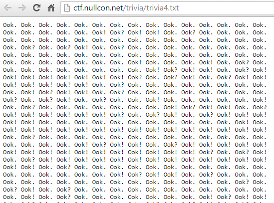

##Trivia 3 (Trivia, 300p)

	We got this log which is highly compressed. Find the intruder's secret.

###ng-version)

Trival 4 | 400pts

Question: Use the file. Get the flag. But, you know what, I hate pipes.

http://ctf.nullcon.net/trivia/trivia4.txt

trivia

If you do Ook! to Text conversion, you will get the below

starting from 0.0.0.0, print the following IPs.

7277067th IP Address

7234562th IP Address

7302657th IP Address

91238th IP Address

746508th IP Address

7211531th IP Address

7300098th IP Address

7211788th IP Address

723558th IP Address

91248th IP Address

7237378th IP Address

723557th IP Address

7234562th IP Address

723567th IP Address

749067th IP Address

Hint: Anything specific about all the IPs?
So we need to generate IPs from 0.0.0.0 to the line we need.

I created a PHP program to generate IPs.

<?php
$a=0; $b=0; $c=0; $d=0; $count=1;
$myfile = fopen(“ip.txt”, “a”) or die(“Unable to open file!”);
for($d=0; $d<256; $d++){
for($c=0; $c<256; $c++){
for($b=0; $b<256; $b++){
for($a=0; $a<256; $a++){
if($count < 8000000){
$txt = $d.”.”.$c.”.”.$b.”.”.$a;
if($count == 1) { fwrite($myfile, $txt); }
else { fwrite($myfile, “\n”. $txt); }
$count++;
}
else { exit(); }
}}}}
fclose($myfile);
?>
so in the 7277067th line you will get IP Address 0.111.10.10. so if you convert it to binary, you will get “z“. doing the same of all the IPs you will get the below.

zi|esjyougotivz
In the question, they mentioned “I hate pipes”. so removing the ” | ” will give you the answer.

Answer: ziesjyougotivz

###ENG version
